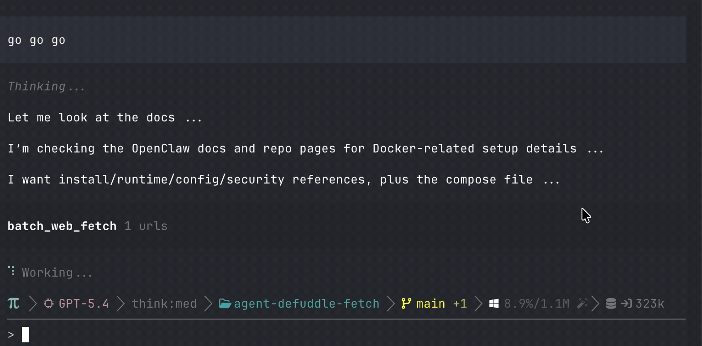

# Agent Smart Fetch

Better web fetching for agents.

## [Smart Fetch for pi.dev](./packages/pi-smart-fetch/README.md)

Registers `web_fetch` and `batch_web_fetch` tools.

## [Smart Fetch for OpenClaw](./packages/openclaw-smart-fetch/README.md)

OpenClaw plugin, registers `smart_fetch` and `batch_smart_fetch` alongside the built-in `web_fetch` tool.



## Features

- **browser-like transport fingerprints** via `wreq-js`, which helps on sites that inspect TLS and HTTP client behavior
- **clean readable extraction** via `Defuddle`, so agents get article content instead of raw noisy HTML
- **better success on bot-defended pages** where plain server-side requests are blocked, challenged, or degraded
- **useful metadata** like title, author, published date, site, and language when available
- **multiple output formats**: `markdown`, `html`, `text`, or `json`
- **single and batch tools**: `web_fetch` for one URL, `batch_web_fetch` for many
- **pi-specific behavior** including an optional `verbose` flag and defaults from pi settings
- **bounded batch fan-out** with a configurable default concurrency of `8`
- **a richer pi TUI for batch mode** with per-item rows, truncated URLs, statuses, and small progress bars
- **lower overhead than browser automation** when you do not need JS execution, login, scrolling, or clicks
- **clear limits**: it does not execute JavaScript or solve interactive anti-bot flows
- **batch fetch support** with a configurable default concurrency of `8`


## Monorepo commands

Install everything:

```bash
bun install
```

Run everything:

```bash
bun run test
bun run build
bun run check
```

Run per package:

```bash
bun run test:core
bun run test:pi
bun run test:openclaw

bun run build:core
bun run build:pi
bun run build:openclaw
```

Integration tests:

```bash
bun run test:integration
```

Install the local pre-commit hook:

```bash
bun run hooks:install
```

## Versioning and publishing

Versioning is global across the monorepo.

Bump all package versions together:

```bash
bun run version:patch
bun run version:minor
bun run version:major
```

Create a release commit and tag:

```bash
bun run release
```

Manual local publish with your npm login:

```bash
bun run publish:pi
bun run publish:openclaw
```

Publish both published packages:

```bash
bun run publish:all
```

## Repository

- GitHub: `https://github.com/Thinkscape/agent-smart-fetch`
